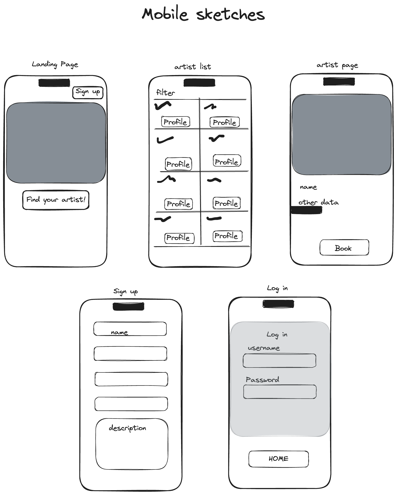
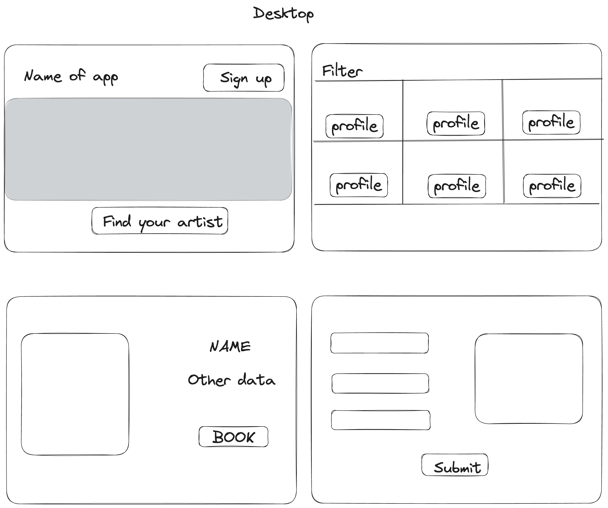

Legato

## Overview

Legato is an app that simplifies the process of finding talented musicians and bands for your next event. Whether you're hosting a wedding, organizing a corporate event, or managing a venue, Gig Grid makes it easy to discover the perfect musical act to elevate your occasion.

### Problem

Finding the right musicians or bands for gigs can be a daunting task. For event organizers, venue managers, and individuals planning special occasions, the process of sourcing and booking talented performers often involves numerous challenges. Traditional methods, such as word-of-mouth referrals or scouring through online directories, are time-consuming and lack efficiency. Additionally, the diverse range of musical genres and preferences adds another layer of complexity to the search process.

On the other side, musicians and bands face their own set of hurdles when it comes to securing gigs. Breaking into the industry, gaining visibility, and finding consistent opportunities to perform can be incredibly challenging, especially for emerging artists.

This is where Gig Grid comes in. By providing a convenient and centralized marketplace for connecting musicians and bands with gigs, Gig Grid streamlines the entire booking process.

### User Profile

- Musicians:
    - looking to market themselves and get gigs that fit their talents.
- Event Organizers:
    - Looking to find the right performer for their special event.

### Features

Event Organizer:
- As a user, I want to be able to find musicians to perform at my event
- As a user, I want to be able to read a description of each performer and even hear their work when possible
- As a user, I want to be able to contact the performer for booking

Musician:
- As a user, I want to be able to create an account and manage my profile 
- As a user, I want to be able to login to my account and manage my inquiries

## Implementation

### Tech Stack

- React
- Node.js
- Express
- Client libraries: 
    - react
    - react-router
    - axios
    - authContext
- Server libraries:
    - knex
    - express
- MySQL
    

### APIs

- No external APIs will be used for this mvp

### Sitemap

- Landing page
- Performer Profile page
- Create account / Registration page
- Login page
- Manage my profile page

### Mockups

### Endpoints

**GET /artists**

- Get performers, an array of performers. Each performer should be an object with data.

Response:
[
    {
        "id": 1,
        "name": "Nate Johnson",
        "type": "Individual performer",
        "Instruments": ["guitar", "drums", "piano"],
        "Styles of music": ["Country"] 
    },
    {
        "id": 2,
        "name": "The Bees Knees",
        "type": "Band",
        "Instruments": ["guitar", "drums", "piano"],
        "styles of music": ["country", "jazz", "rock"]
    }
    ...
]

**GET /artists/:id**

- Get performer by id

Parameters:
- id: performer id as number

Response:
{
    "id": 2,
    "name": "The Bees Knees",
    "type": "Band",
    ""Instruments": ["guitar", "drums", "piano"],
    "styles of music": ["country", "jazz", "rock"]
    "description": "We are the Bees Knees! A trio with guitar, bass and drums that specialices in jazz and rock music."
}

**post /artists**

- Create a new performer 

Parameters:
- name
- photo
- type
- Instruments
- Styles of music
- Description

Response:
{
    "id": 2,
    "name": "The Bees Knees",
    "type": "Band",
    ""Instruments": ["guitar", "drums", "piano"],
    "styles of music": ["country", "jazz", "rock"]
    "description": "We are the Bees Knees! A trio with guitar, bass and drums that specialices in jazz and rock music."
}

**patch /artists/id**

- Edit performer 

Parameters:
- name
- photo
- type
- Instruments
- Styles of music
- Description

Response:
{
    "id": 2,
    "name": "The Bees Knees",
    "photo": something.png
    "type": "Band",
    ""Instruments": ["guitar", "drums", "piano"],
    "styles of music": ["country", "jazz", "rock"]
    "description": "We are the Bees Knees! A trio with guitar, bass and drums that specialices in jazz and rock music."
}

**POST /login**

- Login a user

Parameters:
- email: User's email
- password: User's provided password

Response:

{
    "token": "seyJhbGciOiJIUzI1NiIsInR5cCI6IkpXVCJ9.eyJzdWIiOiIxMjM0NTY3ODkwIiwibmFtZSI6I..."
}

### Auth

JWT

## Roadmap

- Create client
    - react project with routes and boilerplate pages

- Create server
    - express project with routing, with placeholder responses

- Create migrations

- Get 10 sample musicians or bands to start the website with

- Create seeds with sample performers

- Feature: Landing Page
    - Front end Landing page with links to other pages

- Feature: Get requests
    - Back end route to get all performers 
    - Back end route to get each performer 

- Feature: Performers grid
    - All performers page 

- Feature: Performer Page
    - Performer page

- Feature: Post and Put routes
    - Create routes for creating and editing

- Feature: Create account
    - Implement register page 
    - back end endpoint

- Feature: Login
    - Implement login page
    - back end endpoint

- Feature: Implement JWT tokens
    - Server: Update expected requests / responses on protected endpoints
    - Client: Store JWT in local storage, include JWT on axios calls

- Fix all the bugs

- DEMO DAY

## Nice-to-haves

- Location based functionality
- Leaving reviews 
- Messaging within the app
